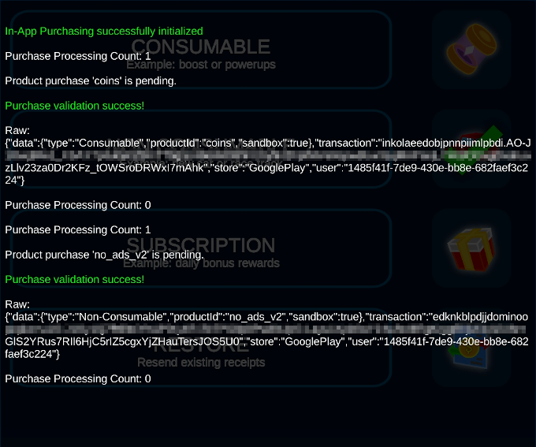

# IAPGUARD Unity SDK

<p align="center">
  
</p>

IAPGUARD SDK for the Unity game engine, providing a sample that contains an in-app purchase implementation including server-side receipt validation for the Apple App Store and Google Play. The [IAPGUARD Platform](https://iapguard.com) is a fully hosted solution, so you do not have to manage your own server or keep track of transactions and App Store API changes. The platform offers a FREE plan to get started. 

**Requirements:**
- You have created a free account on the [IAPGUARD Platform](https://iapguard.com)
- You have created a new app in the IAPGUARD Dashboard
- You should have set up your app and products on the App Store(s) already prior to running this project

## Table of Contents

1. [Installation](#installation)
2. [Project Setup](#project-setup)
3. [Usage](#usage)
5. [Testing](#testing)
6. [Integration](#integration)
7. [Missing Features](#missing-features)
8. [Support](#support)

## Installation

Get this SDK from the [Unity Asset Store](https://assetstore.unity.com/packages/slug/217706?aid=1011lGiF&pubref=website_docs) or from GitHub and import it into your project.

## Project Setup

**Google Play**: You should have created a [Google Play Developer Account](https://play.google.com/apps/publish/signup/), added an application and created in-app purchases for it.  
**Apple App Store**: You should have enrolled in the [Apple Developer Program](https://developer.apple.com/programs/enroll/), added an application and created in-app purchases for it.

- Verify that your project's Package Name matches your App Store's bundle identifier in `Edit > Project Settings > Player > Other Settings > Identification > Package Name`.

This project requires [Unity IAP 5.x](https://docs.unity3d.com/Packages/com.unity.purchasing@5.0/manual/index.html) for billing. When importing this SDK, Unity IAP should have been imported into your project automatically as well. You can verify this by opening `Window > Package Manager`.


Because this project uses both local and server-side receipt validation, follow the next steps for creating your secret files for local validation in Unity IAP. Local receipt validation is only supported on Google Play. You can skip this step if you do not plan to publish on Google Play.

- Open `Edit > Project Settings > Services > In-App Purchasing`
- Make sure that the toggle in the top-right corner is enabled (or enable it)
- Scroll down to the Receipt Obfuscator section
- Find your Google Play Public Key in your Google Play Developer Console under `Your App > Monetise with Play > Monetisation setup > Licensing` / Base64-encoded RSA public key
- Insert the key in Unity and click the Obfuscate button to generate your Google Play tangle file


> **NOTE:** You can now scroll back up and turn off the In App Purchases service again! This does not affect purchasing in any way, it just prevents sending analytics to Unity in case you do not intend to use that.

## Usage

The `Demo` scene provides buttons for each type of in-app product, along with a way to restore transactions. The button logic is mapped to the `UIDemo` script.


If you would like to run the demo with your own products, select the `IAPManager` game object in the Hierarchy and modify the existing ones. The **Id** specified is the product identifier from the App Store. The type has to match with the product type.


For non-consumable products and subscriptions, the `UIDemo` component references game objects for displaying their current purchase state (flag). Verify that your **Id**'s are matching here too.


Then on the buttons, assign each one with a corresponding product Id.



Likewise, select the `IAPGuard` game object and enter the 16-character **App ID** for your app from the IAPGUARD Dashboard. 


## Testing

You will not be able to test from within the Unity Editor, since it cannot establish any connection to App Stores. In the `Demo` scene, a message is shown mentioning this too. You have to test on a real device that is actually able to receive valid sandbox or production receipts and transactions from the App Stores.

> **PLEASE NOTE:** Guides on how to upload your application to the App Stores, or creating test users for Sandbox purchasing is out of scope for this document. Please contact us for further information (see [Support](#support)). 

When running on a real device you will be able to fully test all purchase validation workflows. The `Demo` scene contains an informative console displaying related web requests and responses. In the following screenshot, a consumable and non-consumable product have been bought and validated. If you make use of IAPGUARD's User Inventory feature, the non-consumable product will continue getting reported as owned directly from the IAPGUARD platform (more secure), rather than from local App Store cache.


## Integration

For an offline game, it is recommended to save successful purchases in an encrypted file locally, so players can access them at any time. For an online game or application that integrates player authentication, the most secure way would be making use of IAPGUARD's User Inventory feature and requesting active entitlements on each app launch.

### New Project

**IAPManager:**
You can either rewrite the `IAPManager` script to fit into your game coding, or use it as-is. This script offers a **purchaseSucceededEvent** that you need to subscribe to, in order to define what happens when a product was bought or restored. The event's JSONNode object contains more data about the purchase, such as expiration times for subscriptions. Note that the JSONNode variable can be null if no server validation happened, e.g. when restoring a purchase or running on an unsupported build platform. For presenting relevant errors messages to the user, subscribing to the **purchaseFailedEvent** is recommended too.

**IAPGuard:**
The `IAPGuard` component offers a **validationCallback** event for the web validation response - the sample `IAPManager` subscribes to it already.

Integration in a new project can be done by following these instructions:

1. Place the `IAPManager` and `IAPGuard` prefabs located at `IAPGuard > Prefabs` into the first scene of your application and edit them in the Inspector.
2. Let your shop buttons call **IAPManager.Instance.Purchase(productId)**.
3. Have your shop script subscribe to **IAPManager.purchaseSucceededEvent** and **IAPManager.purchaseFailedEvent** as mentioned above to grant rewards.
4. Add a shop button that calls **IAPManager.Instance.RestoreTransactions()** (required for Apple App Store).
5. Let your shop script subscribe to **IAPManager.Instance.controller.OnCheckEntitlement** and call **IAPManager.Instance.IsPurchased()** for checking product states manually.

### Existing Project

When integrating this SDK into an existing project that already implements Unity IAP, the following points need to be done:

1. Add the IAPGUARD prefab to your project
2. Initialize the IAPGUARD component
3. Extend your OnPurchasePending method with IAPGUARD
4. Act on IAPGUARD's validationCallback event
6. Add a way to let users sync existing transactions with IAPGUARD

---

1. Place the `IAPGuard` prefab located at `IAPGuard > Prefabs` into the first scene of your game.

2. In your Unity IAP handler's code:

   - add the SDK namespace at the top:
    ```md
    using FLOBUK.IAPGUARD;
    ```
   - after getting a controller reference from **UnityIAPServices.StoreController()**, pass it to the `IAPGuard` component for initialization:
    ```md
    IAPGuard.Instance.Initialize(controller);
    IAPGuard.validationCallback += OnServerValidationResult;
    ```

3. In your Unity IAP **OnPurchasePending(PendingOrder order)** implementation, pass the order for validation to IAPGUARD and get its PurchaseState:

    ```md
    PurchaseState state = IAPGuard.Instance.RequestPurchase(order);
    ```

    - On PurchaseState = **Pending**, return from the method to keep the transaction open for processing.
    - On PurchaseState = **Failed**, call controller.ConfirmPurchase(order) to close the transaction.
    - On PurchaseState = **Purchased**, grant the reward and call controller.ConfirmPurchase(order) to close the transaction. 

4. In the previous step, a user is already rewarded on **PurchaseState = Purchased**. However, this only handled the edge case where IAPGUARD might not be supported. Now, we have to implement rewards when IAPGUARD completes the transaction with server side validation too.
      ```md
      //incoming server-side receipt validation result from IAPGUARD
      private void OnServerValidationResult(bool success, Product product, JSONNode serverData)
      {
          if (success)
          {
              //IAPGUARD server receipt validation passed, reward can be granted
          }
          else
          {
              //IAPGUARD server receipt validation failed, pass error object or raw string if empty
              string errorMessage = serverData ? serverData.ToString() : "Unexpected Response.";
          }
      }
      ```

5. You will want to allow users to manually restore their purchases and re-sync them with the IAPGUARD backend, in case they switch devices, user IDs or lost their local storage by other means. Extend your Unity IAP implementation of RestoreTransactions() with a call to IAPGUARD as shown below:

      ```md
      public void RestoreTransactions()
      {
        #if UNITY_IOS
			    controller.RestoreTransactions((result, message) =>
          {
            if (result == true) IAPGuard.Instance.RequestRestore();
          });
        #else
          IAPGuard.Instance.RequestRestore();
        #endif
      }
      ```


### User Inventory

If you would like to use IAPGUARD's User Inventory feature (requires paid plan) for improved security measures on replay attacks and receipt sharing prevention, please follow the additional integration steps below. 

1. On the IAPGUARD Dashboard, edit your app and set `User Behaviour` to something other than `Disabled` (see documentation for dropdown explanation)
2. In Unity, on the `IAPGuard` prefab set the `Inventory Request Type` to a value other than `Disabled` in the Inspector.
3. Assign a player's unique user ID to **IAPGuard.Instance.userID** when they've signed into an Authentication System of your choice (not included).
4. Subscribe to the **IAPGuard.inventoryCallback** event and call **IAPGuard.Instance.RequestInventory()** once the user ID is set.
5. For checking product entitlements you can now act upon the inventory returned by **IAPGuard.inventoryCallback** or by calling **IAPGuard.Instance.GetInventory()** manually.

## Missing Features

The purpose of this SDK is to quickly get up and running with in-app purchases and server-side receipt validation, while keeping it as simple as possible for you to extend and build upon.

A paid Unity plugin for in-app purchases supporting:
- category, product and virtual currency management right in the Unity Editor
- automatic handling of virtual product purchases (for virtual currency)
- product overrides for different App Store IDs
- local storage of purchases for offline use
- several shop scenes for vertical or horizontal item alignment

in addition to built-in support for IAPGUARD, is available on the [Unity Asset Store](https://assetstore.unity.com/packages/slug/192362?aid=1011lGiF&pubref=website_docs).

## Support

This asset was specifically designed to be used in combination with [IAPGUARD](https://iapguard.com). For integration assistance or questions about the Service, please open a **Support ticket** within the [IAPGUARD Dashboard](https://dash.iapguard.com).