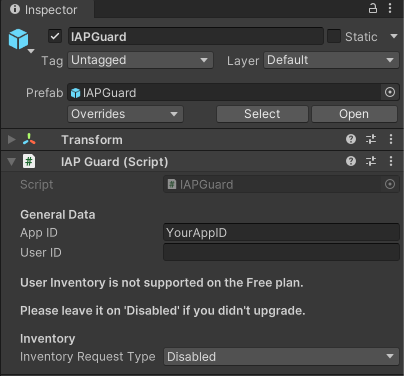

# Receipt Validator SDK

<p align="center">
  
</p>

A sample project for the Unity game engine, that contains fully working in-app purchase implementations including server-side receipt validation for the Apple App Store and Google Play. The [Receipt Validator Service](https://flobuk.com/validator) is a fully hosted solution, so you do not have to manage your own server or keep track of transactions and App Store API changes. The service offers a FREE plan to get started. 

**Requirements:**
- You have created a free account on the [Receipt Validator Service](https://flobuk.com/validator)
- You have created a new app in the Receipt Validator dashboard
- You should have set up your app and products on the App Store(s) already prior to running this project

## Table of Contents

1. [Project Setup](#project-setup)
2. [Installation](#installation)
3. [Usage](#usage)
5. [Testing](#testing)
6. [Integration](#integration)
7. [Missing Features](#missing-features)
8. [Support](#support)

## Project Setup

**Google Play**: You should have created a [Google Play Developer Account](https://play.google.com/apps/publish/signup/), added an application and created in-app purchases for it.  
**Apple App Store**: You should have enrolled in the [Apple Developer Program](https://developer.apple.com/programs/enroll/), added an application and created in-app purchases for it.

- Verify that your project's Package Name matches your App Store's bundle identifier in `Edit > Project Settings > Player > Other Settings > Identification > Package Name`.

This project requires [Unity IAP](https://docs.unity3d.com/Packages/com.unity.purchasing@4.11/manual/index.html) for billing. Import the latest Unity IAP package in your project via `Window > Package Manager`.


Because this project uses both local and server-side validation, follow the next steps for creating your secret files for local validation in Unity IAP.

- Open `Edit > Project Settings > Services > In-App Purchasing`
- Make sure that the toggle in the top-right corner is enabled (or enable it)
- Scroll down to the Receipt Obfuscator section
  - Google Play: find your Google Play Public Key in your Google Play Developer Console under Your App > Monetise > Monetisation setup > Google Play Billing > Base64-encoded RSA public key
  - Apple App Store: no setup necessary
- Click the Obfuscate buttons to generate your Google Play and Apple Tangle files


:::note
You can now scroll back up and turn off the In App Purchases service again! This does not affect purchasing in any way, it just prevents sending analytics to Unity in case you do not intend to use that.
:::

## Installation

Get this plugin from the [Unity Asset Store](https://assetstore.unity.com/packages/slug/217706?aid=1011lGiF&pubref=website_docs) or from GitHub and import it into your project.

## Usage

The `Demo` scene provides buttons for buying each type of in-app product, along with a way to restore transactions. The logic for this is in the `UIDemo` script.


If you wish to use your own products in the `Demo` scene, select the `IAPManager` game object in the Hierarchy and modify the existing ones. The **ID** you enter here is the product identifier from the App Store.


Likewise, select the `ReceiptValidator` game object and enter your own **App ID** from the Receipt Validator Service. 



## Testing

Since the Unity Editor does not have any connection to App Stores, you are not able to test purchases using it. In the `Demo` scene, a message is shown mentioning this too. You have to test on a real device that is actually able to receive valid receipts and transactions from the App Stores.

> **PLEASE NOTE:** Guides on how to upload your application to the App Stores, or creating test users for Sandbox purchasing is out of scope for this document. If you need help with that, please contact us (see [Support](#support)). 

When running on a real device you will be able to fully test all purchase validation workflows. Press the **SHOW LOG** button to display an informative console about web requests. In the following screenshot, a consumable and non-consumable product have been bought and validated. If you make use of the Receipt Validator's User Inventory feature, the non-consumable product will be returned for that user in subsequent app launches as well.


## Integration

### New Project

**IAPManager:**
You can either rewrite the `IAPManager` script to fit into your game coding, or use it as-is. This script offers a **purchaseCallback** event that you would want to subscribe to, in order to define what happens when a purchase event is received. Check that the *success* boolean is true before accessing the *data* JSONNode and granting the corresponding product to the player. Note that the *data* JSONNode will return only the product ID, if the purchase was restored, or if server validation was disabled or does not support the build platform.

It is recommended to save successful purchases in an encrypted file locally, so you can access them at any time and players can also use them when playing offline.

**ReceiptValidator:**
The `ReceiptValidator` script offers a **purchaseCallback** event for the web response as well - when using your own `IAPManager`, it should subscribe to this. Also, an **inventoryCallback** event that returns active purchases. If you are making use of the Receipt Validator User Inventory feature, you would subscribe to this event after player authentication and `ReceiptValidator` initialization, call *ReceiptValidator.RequestInventory()* and act on the products and status it returns. In this demo, if enabled (requires paid plan), the `UIDemo` script checks User Inventory and sets the purchase status of the products accordingly.

### Existing Project

For an integration in an existing project that already implements Unity IAP, the following points need to be done:

1. Instantiate the ReceiptValidator prefab
2. Initialize the ReceiptValidator component (`Initialize`)
3. Extend the ProcessPurchase method with validation (`RequestPurchase`)
4. Link the ReceiptValidator's purchaseCallback Action
5. (optional) Add User Inventory (`RequestInventory`, `GetInventory`)
6. Add a way to let users restore their transactions (`RequestRestore`)

---
1. Place the `Prefabs > ReceiptValidator` prefab into the first scene of your application. It calls DontDestroyOnLoad on itself and therefore persists across scene changes, but is not initialized until you do so.

2. In your Unity IAP handler's code:

   - add the asset's namespace at the top:
      ```md
      using FLOBUK.ReceiptValidator;
      ```
   - when you call `ConfigurationBuilder.Instance` to create a store module, save a reference to the ConfigurationBuilder in a variable as we will need it in the next step. In the IAPManagerDemo script, this is done in Initialize().
   - in your `OnInitialized` implementation, initialize the ReceiptValidator component by passing in the IStoreController and ConfigurationBuilder reference stored previously:
      ```md
      ReceiptValidator.Instance.Initialize(controller, builder);
      ```

3. In your `ProcessPurchase` implementation, pass the received product for validation to the ReceiptValidator and get its PurchaseState:
      ```md
      PurchaseState state = ReceiptValidator.Instance.RequestPurchase(product);
      ```

    If the PurchaseState is `Pending`, it is important that you return `PurchaseProcessingResult.Pending` to keep the transaction open. If the transaction was processed, we will receive a callback from the ReceiptValidator in the next step. Otherwise, the transaction was completed. You will then want to reward the user in case the PurchaseState is `Purchased` (not in case it is `Failed`) and return `PurchaseProcessingResult.Complete`.

4. In the previous step, we already rewarded the user if the transaction was complete. However, we only handled the Unity IAP part, in case the Receipt Validator was not used. Now, we have to implement the Receipt Validator callback when finishing a transaction too. In `OnInitialized`, below the initialization call add:
      ```md
      ReceiptValidator.purchaseCallback += OnPurchaseResult;
      ```
    
    To keep things simple, in the IAPManager demo script we defined a separate `OnPurchaseResult` method that is also used in the `ProcessPurchase` implementation. This means that both interfaces call the same method to reward the user.

5. **PAID PLAN ONLY:** if you make use of user authentication and inventory, the user's purchases are stored in the backend. To retrieve them, on the ReceiptValidator prefab set the `Inventory Request Type` to a value other than `Disabled` and add the following line at the end of `OnInitialized`:

      ```md
      ReceiptValidator.Instance.RequestInventory();
      ```

    You can either retrieve the inventory by subscribing to the `ReceiptValidator.inventoryCallback` action or by calling `ReceiptValidator.Instance.GetInventory()` manually later.
    
6. You will want to allow users to manually restore their purchases and re-sync them with the Receipt Validator backend, in case they switch devices, user IDs or lost their local storage in other ways. Add the below method and let the user call it manually.

      ```md
      public void RestoreTransactions()
      {
        #if UNITY_IOS
          extensions.GetExtension<IAppleExtensions>().RestoreTransactions(null);
        #else
          ReceiptValidator.Instance.RequestRestore();
        #endif
      }
      ```

## Missing Features

The purpose of this SDK is to quickly get up and running with in-app purchases and server-side receipt validation, while keeping it as simple as possible for you to extend and build upon.

A paid plugin for in-app purchases supporting:
- category, product and virtual currency management right in the Unity Editor
- automatic handling of virtual product purchases (for virtual currency)
- product overrides for different App Store IDs
- local storage of purchases for offline use
- several shop scenes for vertical or horizontal item alignment

in addition to built-in support for server-side receipt validation, is available on the [Unity Asset Store](https://assetstore.unity.com/packages/slug/192362?aid=1011lGiF&pubref=website_docs).

## Support

This plugin was specifically designed to be used in combination with the [Receipt Validator Service](https://flobuk.com/validator). For integration assistance or questions about the Service, please open a ticket at the **Support** tab in the Receipt Validator dashboard.